# Estimate System
> Generated by [`prisma-markdown`](https://github.com/samchon/prisma-markdown)

- [EstimateSystem](#estimatesystem)
- [Shop](#shop)
- [CPU](#cpu)
- [GPU](#gpu)
- [MotherBoard](#motherboard)
- [RAM](#ram)
- [DISK](#disk)

## EstimateSystem

```mermaid
erDiagram
"estimate" {
    String id PK
    String name
    Country country
    DateTime created_at
    DateTime updated_at
    DateTime deleted_at "nullable"
}
"shop" {
    String id PK
    String name UK
    Country country
    DateTime created_at
    DateTime updated_at
    DateTime deleted_at "nullable"
}
"ai_answer" {
    String id PK
    String name
    Float table_price
    Float buying_price
    Currency currency
    String metadata "nullable"
    DateTime created_at
    DateTime updated_at
    DateTime deleted_at "nullable"
}
"cpu_estimate" {
    String id PK
    String cpu_id FK
    String estimate_id FK
    String shop_id FK
    String ai_answer_id FK
    DateTime created_at
    DateTime updated_at
    DateTime deleted_at "nullable"
}
"cpu" {
    String id PK
    String hw_key UK
    String model_name
    String vendor
    Int core_count
    Int thread_count "nullable"
    Float base_clock "nullable"
    Float boost_clock "nullable"
    String metadata "nullable"
    DateTime created_at
    DateTime updated_at
    DateTime deleted_at "nullable"
}
"gpu" {
    String id PK
    String hw_key UK
    String model_name
    String chipset
    String vendor
    String sub_vendor "nullable"
    String metadata "nullable"
    DateTime created_at
    DateTime updated_at
    DateTime deleted_at "nullable"
}
"motherboard" {
    String id PK
    String hw_key UK
    String model_name
    String vendor
    String chipset
    String metadata "nullable"
    DateTime created_at
    DateTime updated_at
    DateTime deleted_at "nullable"
}
"ram" {
    String id PK
    String hw_key UK
    String model_name
    String vendor
    String metadata "nullable"
    DateTime created_at
    DateTime updated_at
    DateTime deleted_at "nullable"
}
"disk" {
    String id PK
    String hw_key UK
    String model_name
    String vendor
    String kind
    Int total_space
    String metadata "nullable"
    DateTime created_at
    DateTime updated_at
    DateTime deleted_at "nullable"
}
"motherboard_estimate" {
    String id PK
    String motherboard_id FK
    String estimate_id FK
    String shop_id FK
    String ai_answer_id FK
    DateTime created_at
    DateTime updated_at
    DateTime deleted_at "nullable"
}
"gpu_estimate" {
    String id PK
    String gpu_id FK
    String estimate_id FK
    String shop_id FK
    String ai_answer_id FK
    DateTime created_at
    DateTime updated_at
    DateTime deleted_at "nullable"
}
"ram_estimate" {
    String id PK
    String ram_id FK
    String estimate_id FK
    String shop_id FK
    String ai_answer_id FK
    DateTime created_at
    DateTime updated_at
    DateTime deleted_at "nullable"
}
"disk_estimate" {
    String id PK
    String disk_id FK
    String estimate_id FK
    String shop_id FK
    String ai_answer_id FK
    DateTime created_at
    DateTime updated_at
    DateTime deleted_at "nullable"
}
"cpu_pricing_table" {
    String id PK
    String shop_id FK
    String sheets
    DateTime created_at
    DateTime updated_at
    DateTime deleted_at "nullable"
}
"gpu_pricing_table" {
    String id PK
    String shop_id FK
    String sheets
    DateTime created_at
    DateTime updated_at
    DateTime deleted_at "nullable"
}
"cpu_estimate" }o--|| "cpu" : cpu
"cpu_estimate" }o--|| "estimate" : estimate
"cpu_estimate" }o--|| "shop" : shop
"cpu_estimate" }o--|| "ai_answer" : ai_answer
"motherboard_estimate" }o--|| "motherboard" : motherboard
"motherboard_estimate" }o--|| "estimate" : estimate
"motherboard_estimate" }o--|| "shop" : shop
"motherboard_estimate" }o--|| "ai_answer" : ai_answer
"gpu_estimate" }o--|| "gpu" : gpu
"gpu_estimate" }o--|| "estimate" : estimate
"gpu_estimate" }o--|| "shop" : shop
"gpu_estimate" }o--|| "ai_answer" : ai_answer
"ram_estimate" }o--|| "ram" : ram
"ram_estimate" }o--|| "estimate" : estimate
"ram_estimate" }o--|| "shop" : shop
"ram_estimate" }o--|| "ai_answer" : ai_answer
"disk_estimate" }o--|| "disk" : disk
"disk_estimate" }o--|| "estimate" : estimate
"disk_estimate" }o--|| "shop" : shop
"disk_estimate" }o--|| "ai_answer" : ai_answer
"cpu_pricing_table" }o--|| "shop" : shop
"gpu_pricing_table" }o--|| "shop" : shop
```

### `estimate`

**Properties**
  - `id`: 
  - `name`: 
  - `country`: 
  - `created_at`: 
  - `updated_at`: 
  - `deleted_at`: 

### `shop`

**Properties**
  - `id`: 
  - `name`: 
  - `country`: 
  - `created_at`: 
  - `updated_at`: 
  - `deleted_at`: 

### `ai_answer`

**Properties**
  - `id`: 
  - `name`: 
  - `table_price`: 
  - `buying_price`: 
  - `currency`: 
  - `metadata`: 
  - `created_at`: 
  - `updated_at`: 
  - `deleted_at`: 

### `cpu_estimate`

**Properties**
  - `id`: 
  - `cpu_id`: 
  - `estimate_id`: 
  - `shop_id`: 
  - `ai_answer_id`: 
  - `created_at`: 
  - `updated_at`: 
  - `deleted_at`: 

### `cpu`

**Properties**
  - `id`: 
  - `hw_key`: 
  - `model_name`: 
  - `vendor`: 
  - `core_count`: 
  - `thread_count`: 
  - `base_clock`: 
  - `boost_clock`: 
  - `metadata`: 
  - `created_at`: 
  - `updated_at`: 
  - `deleted_at`: 

### `gpu`

**Properties**
  - `id`: 
  - `hw_key`: 
  - `model_name`: 
  - `chipset`: 
  - `vendor`: 
  - `sub_vendor`: 
  - `metadata`: 
  - `created_at`: 
  - `updated_at`: 
  - `deleted_at`: 

### `motherboard`

**Properties**
  - `id`: 
  - `hw_key`: 
  - `model_name`: 
  - `vendor`: 
  - `chipset`: 
  - `metadata`: 
  - `created_at`: 
  - `updated_at`: 
  - `deleted_at`: 

### `ram`

**Properties**
  - `id`: 
  - `hw_key`: 
  - `model_name`: 
  - `vendor`: 
  - `metadata`: 
  - `created_at`: 
  - `updated_at`: 
  - `deleted_at`: 

### `disk`

**Properties**
  - `id`: 
  - `hw_key`: 
  - `model_name`: 
  - `vendor`: 
  - `kind`: 
  - `total_space`: 
  - `metadata`: 
  - `created_at`: 
  - `updated_at`: 
  - `deleted_at`: 

### `motherboard_estimate`

**Properties**
  - `id`: 
  - `motherboard_id`: 
  - `estimate_id`: 
  - `shop_id`: 
  - `ai_answer_id`: 
  - `created_at`: 
  - `updated_at`: 
  - `deleted_at`: 

### `gpu_estimate`

**Properties**
  - `id`: 
  - `gpu_id`: 
  - `estimate_id`: 
  - `shop_id`: 
  - `ai_answer_id`: 
  - `created_at`: 
  - `updated_at`: 
  - `deleted_at`: 

### `ram_estimate`

**Properties**
  - `id`: 
  - `ram_id`: 
  - `estimate_id`: 
  - `shop_id`: 
  - `ai_answer_id`: 
  - `created_at`: 
  - `updated_at`: 
  - `deleted_at`: 

### `disk_estimate`

**Properties**
  - `id`: 
  - `disk_id`: 
  - `estimate_id`: 
  - `shop_id`: 
  - `ai_answer_id`: 
  - `created_at`: 
  - `updated_at`: 
  - `deleted_at`: 

### `cpu_pricing_table`

**Properties**
  - `id`: 
  - `shop_id`: 
  - `sheets`: 
  - `created_at`: 
  - `updated_at`: 
  - `deleted_at`: 

### `gpu_pricing_table`

**Properties**
  - `id`: 
  - `shop_id`: 
  - `sheets`: 
  - `created_at`: 
  - `updated_at`: 
  - `deleted_at`: 

## Shop

### `shop`

**Properties**
  - `id`: 
  - `name`: 
  - `country`: 
  - `created_at`: 
  - `updated_at`: 
  - `deleted_at`: 

### `cpu_pricing_table`

**Properties**
  - `id`: 
  - `shop_id`: 
  - `sheets`: 
  - `created_at`: 
  - `updated_at`: 
  - `deleted_at`: 

### `gpu_pricing_table`

**Properties**
  - `id`: 
  - `shop_id`: 
  - `sheets`: 
  - `created_at`: 
  - `updated_at`: 
  - `deleted_at`: 

## CPU

### `shop`

**Properties**
  - `id`: 
  - `name`: 
  - `country`: 
  - `created_at`: 
  - `updated_at`: 
  - `deleted_at`: 

### `ai_answer`

**Properties**
  - `id`: 
  - `name`: 
  - `table_price`: 
  - `buying_price`: 
  - `currency`: 
  - `metadata`: 
  - `created_at`: 
  - `updated_at`: 
  - `deleted_at`: 

### `cpu_estimate`

**Properties**
  - `id`: 
  - `cpu_id`: 
  - `estimate_id`: 
  - `shop_id`: 
  - `ai_answer_id`: 
  - `created_at`: 
  - `updated_at`: 
  - `deleted_at`: 

### `cpu`

**Properties**
  - `id`: 
  - `hw_key`: 
  - `model_name`: 
  - `vendor`: 
  - `core_count`: 
  - `thread_count`: 
  - `base_clock`: 
  - `boost_clock`: 
  - `metadata`: 
  - `created_at`: 
  - `updated_at`: 
  - `deleted_at`: 

### `cpu_pricing_table`

**Properties**
  - `id`: 
  - `shop_id`: 
  - `sheets`: 
  - `created_at`: 
  - `updated_at`: 
  - `deleted_at`: 

## GPU

### `shop`

**Properties**
  - `id`: 
  - `name`: 
  - `country`: 
  - `created_at`: 
  - `updated_at`: 
  - `deleted_at`: 

### `ai_answer`

**Properties**
  - `id`: 
  - `name`: 
  - `table_price`: 
  - `buying_price`: 
  - `currency`: 
  - `metadata`: 
  - `created_at`: 
  - `updated_at`: 
  - `deleted_at`: 

### `gpu`

**Properties**
  - `id`: 
  - `hw_key`: 
  - `model_name`: 
  - `chipset`: 
  - `vendor`: 
  - `sub_vendor`: 
  - `metadata`: 
  - `created_at`: 
  - `updated_at`: 
  - `deleted_at`: 

### `gpu_estimate`

**Properties**
  - `id`: 
  - `gpu_id`: 
  - `estimate_id`: 
  - `shop_id`: 
  - `ai_answer_id`: 
  - `created_at`: 
  - `updated_at`: 
  - `deleted_at`: 

### `gpu_pricing_table`

**Properties**
  - `id`: 
  - `shop_id`: 
  - `sheets`: 
  - `created_at`: 
  - `updated_at`: 
  - `deleted_at`: 

## MotherBoard

### `motherboard`

**Properties**
  - `id`: 
  - `hw_key`: 
  - `model_name`: 
  - `vendor`: 
  - `chipset`: 
  - `metadata`: 
  - `created_at`: 
  - `updated_at`: 
  - `deleted_at`: 

### `motherboard_estimate`

**Properties**
  - `id`: 
  - `motherboard_id`: 
  - `estimate_id`: 
  - `shop_id`: 
  - `ai_answer_id`: 
  - `created_at`: 
  - `updated_at`: 
  - `deleted_at`: 

## RAM

### `ram`

**Properties**
  - `id`: 
  - `hw_key`: 
  - `model_name`: 
  - `vendor`: 
  - `metadata`: 
  - `created_at`: 
  - `updated_at`: 
  - `deleted_at`: 

### `ram_estimate`

**Properties**
  - `id`: 
  - `ram_id`: 
  - `estimate_id`: 
  - `shop_id`: 
  - `ai_answer_id`: 
  - `created_at`: 
  - `updated_at`: 
  - `deleted_at`: 

## DISK

### `disk`

**Properties**
  - `id`: 
  - `hw_key`: 
  - `model_name`: 
  - `vendor`: 
  - `kind`: 
  - `total_space`: 
  - `metadata`: 
  - `created_at`: 
  - `updated_at`: 
  - `deleted_at`: 

### `disk_estimate`

**Properties**
  - `id`: 
  - `disk_id`: 
  - `estimate_id`: 
  - `shop_id`: 
  - `ai_answer_id`: 
  - `created_at`: 
  - `updated_at`: 
  - `deleted_at`: 